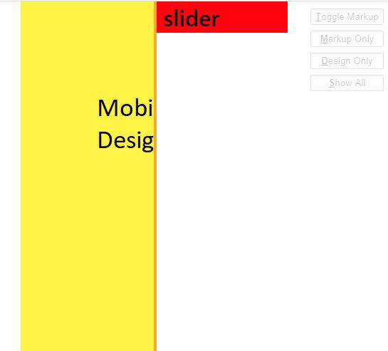

# Svelte Design Slider

This is a barebones project template for [Svelte](https://svelte.dev) apps.
It is based off the template at https://github.com/sveltejs/template.

The main feature is the DesignSlider component that lets you insert images of your designs, with a slider that lets you see either the design or your markup. Currently there are two images that are supported, one for mobile and one for desktop.



## Get started

Degit the repo (clone without git history)

```bash
npx degit patricktouchette/svelte-design-slider
```

Install the dependencies

```bash
npm install
```

Start the dev server

```bash
npm run dev
```

Build production version. Remember to remove the slider component from your svelte files

```bash
npm run build
```

Navigate to [localhost:5000](http://localhost:5000). You should see your app running.

## Using the design slider component

You will need to replace the images with your own and provide the dimensions of your mobile and desktop design images.

In the css change the max-width properties.

In the DesignSlider, change:

- width
- height
- mobileWidth
- mobileHeight

The sliderPosition lets you adjust how much of the design you see, where 0% puts the bar to the complete left , and 100% puts it to the complete right.

Inside `App.svelte`

```html
<script>
  import DesignSlider from './components/DesignSlider.svelte';
</script>

<style>
  /* Make sure the max-widths are the same */
  /* for <main> and the design slider  */
  main {
    width: 100%;
    margin: 0 auto;
    max-width: 375px;
    text-align: center;
    background: red;
  }

  @media (min-width: 1000px) {
    main {
      max-width: 1440px;
    }
  }
</style>

<DesignSlider
  sliderPosition="50%"
  width="1440px"
  height="2500px"
  mobileWidth="375px"
  mobileHeight="3000px"
  desktopImg="./images/desktop-design.jpg"
  mobileImg="./images/mobile-design.jpg"
/>

<main>
  <h1>design slider</h1>
</main>
```

## Keyboard Shortcuts

| key       | action                                |
| --------- | ------------------------------------- |
| left      | Moves the slider left                 |
| right     | Moves the slider right                |
| t         | Toggle the Markup                     |
| m         | Show your markup only                 |
| d         | Show only the design image            |
| s         | Show everything                       |
| a + click | Measure distance between two points\* |

\* _Hold 'a' down, then move the slider with your mouse, upon release, check your console.log, you will have the measurement._
